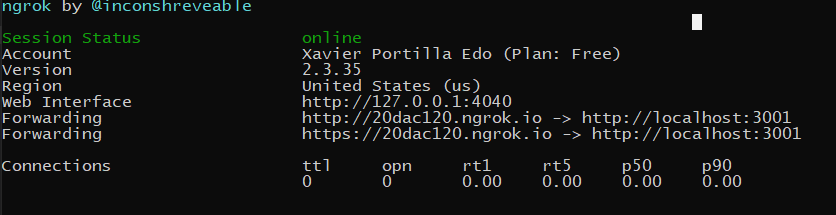

# Alexa Skill, AWS CloudFormation and Serverless Application Model (SAM)

This project contains source code and supporting files for a serverless application that you can deploy with the SAM CLI. It includes the following files and folders.

- HelloWorldFunction/src/main - Code for the application's Lambda function.
- events - Invocation events that you can use to invoke the function.
- template.yaml - A template that defines the application's AWS resources.

The application uses several AWS resources, including Lambda functions. These resources are defined in the `template.yaml` file in this project. You can update the template to add AWS resources through the same deployment process that updates your application code.

## Prerequisites

The **Serverless Application Model Command Line Interface (SAM CLI)** is an extension of the AWS CLI that adds functionality for building and testing Lambda applications. 
It uses **Docker** to run your functions in an Amazon Linux environment that matches Lambda. It can also emulate your application's build environment.

To use the SAM CLI, you need the following tools.

* SAM CLI - [Install the SAM CLI](https://docs.aws.amazon.com/serverless-application-model/latest/developerguide/serverless-sam-cli-install.html)
* Java8 - [Install the Java SE Development Kit 8](http://www.oracle.com/technetwork/java/javase/downloads/jdk8-downloads-2133151.html)
* Maven - [Install Maven](https://maven.apache.org/install.html)
* Docker - [Install Docker community edition](https://hub.docker.com/search/?type=edition&offering=community)

## Use the SAM CLI to build your skill locally

Build your application with the `sam build` command.

To build and deploy your application for the first time, run the following in your shell:

```bash
sam build HelloWorldFunction --template template.yaml --build-dir HelloWorldFunction\.aws-sam\build
```

The SAM CLI installs dependencies defined in `HelloWorldFunction/pom.xml`, creates a deployment package, and saves it in the `.aws-sam/build` folder.


## Run your skill locally

Test a single function by invoking it directly with a test event. An event is a JSON document that represents the input that the function receives from the event source. Test events are included in the `events` folder in this project.

Run functions locally and invoke them with the `sam local invoke` command.

```bash
sam local invoke HelloWorldFunction --template HelloWorldFunction\.aws-sam\build\template.yaml
```

**NOTE:** Using LocalDebugger.java is as easy as **run** with visual studio code or IntelliJ. Take a look to the configurations of both IDEs in:
For this type of running it is not necessary to run any SAM CLI Command.
1. `.vscode\launch.json`
2. `.idea\runConfigurations\LocalDebugger.xml`


## Debug your skill locally

Tests are defined in the `events` folder in this project.

```bash
sam local invoke HelloWorldFunction --template HelloWorldFunction\.aws-sam\build\template.yaml --event events/event.json --debug-port 56531
```
With the AWS Toolkit installed in your IDE it easy to set up and debug with breakpoints your skills dependending on the event.json

**NOTE:** Using LocalDebugger.java is as easy as **debug** with visual studio code or IntelliJ. Take a look to the configurations of both IDEs in:
For this type of running it is not necessary to run any SAM CLI Command.
1. `.vscode\launch.json`
2. `.idea\runConfigurations\LocalDebugger.xml`

## Test your skill locally

Tests are defined in the `events` folder in this project.

```bash
sam local invoke HelloWorldFunction --template HelloWorldFunction\.aws-sam\build\template.yaml --event  events/event.json
```

**NOTE:** Using LocalDebugger.java you can make the request below to http://localhost:3001/:

In the event.json you have an example of a LaunchRequest mocked from a skill. Take a look:

```json
{
  "version": "1.0",
  "session": {
    "new": true,
    "sessionId": "amzn1.echo-api.session.[unique-value-here]",
    "application": {
      "applicationId": "amzn1.ask.skill.[unique-value-here]"
    },
    "user": {
      "userId": "amzn1.ask.account.[unique-value-here]"
    },
    "attributes": {}
  },
  "context": {
    "AudioPlayer": {
      "playerActivity": "IDLE"
    },
    "System": {
      "application": {
        "applicationId": "amzn1.ask.skill.[unique-value-here]"
      },
      "user": {
        "userId": "amzn1.ask.account.[unique-value-here]"
      },
      "device": {
        "supportedInterfaces": {
          "AudioPlayer": {}
        }
      }
    }
  },
  "request": {
    "type": "LaunchRequest",
    "requestId": "amzn1.echo-api.request.[unique-value-here]",
    "timestamp": "2016-10-27T18:21:44Z",
    "locale": "en-US"
  }
}


```

## Test requests directly from Alexa

ngrok is a very cool, lightweight tool that creates a secure tunnel on your local machine along with a public URL you can use for browsing your local site or APIs.

When ngrok is running, it listens on the same port that you’re local web server is running on and proxies external requests to your local machine

From there, it’s a simple step to get it to listen to your web server. Say you’re running your local web server on port 3001. In terminal, you’d type in: `ngrok http 3001`. This starts ngrok listening on port 3001 and creates the secure tunnel:



So now you have to go to [Alexa Developer console](https://developer.amazon.com/alexa/console/ask), go to your skill > endpoints > https, add the https url generated above . Eg: https://20dac120.ngrok.io.

Select the My development endpoint is a sub-domain.... option from the dropdown and click save endpoint at the top of the page.

Go to Test tab in the Alexa Developer Console and launch your skill.

The Alexa Developer Console will send a HTTPS request to the ngrok endpoint (https://20dac120.ngrok.io) which will route it to your skill running on Web API server at http://localhost:3001.


## Deploy your skill to AWS

To deploy your application for the first time, run the following in your shell:

```bash
sam deploy --guided
```

The first command will build the source of your application. The second command will package and deploy your application to AWS, with a series of prompts:

* **Stack Name**: The name of the stack to deploy to CloudFormation. This should be unique to your account and region, and a good starting point would be something matching your project name.
* **AWS Region**: The AWS region you want to deploy your app to.
* **Confirm changes before deploy**: If set to yes, any change sets will be shown to you before execution for manual review. If set to no, the AWS SAM CLI will automatically deploy application changes.
* **Allow SAM CLI IAM role creation**: Many AWS SAM templates, including this example, create AWS IAM roles required for the AWS Lambda function(s) included to access AWS services. By default, these are scoped down to minimum required permissions. To deploy an AWS CloudFormation stack which creates or modified IAM roles, the `CAPABILITY_IAM` value for `capabilities` must be provided. If permission isn't provided through this prompt, to deploy this example you must explicitly pass `--capabilities CAPABILITY_IAM` to the `sam deploy` command.
* **Save arguments to samconfig.toml**: If set to yes, your choices will be saved to a configuration file inside the project, so that in the future you can just re-run `sam deploy` without parameters to deploy changes to your application.

## Add a resource to your application
The application template uses AWS Serverless Application Model (AWS SAM) to define application resources. AWS SAM is an extension of AWS CloudFormation with a simpler syntax for configuring common serverless application resources such as functions, triggers, and APIs. For resources not included in [the SAM specification](https://github.com/awslabs/serverless-application-model/blob/master/versions/2016-10-31.md), you can use standard [AWS CloudFormation](https://docs.aws.amazon.com/AWSCloudFormation/latest/UserGuide/aws-template-resource-type-ref.html) resource types.

##Integrate it in your favourite editor

If you prefer to use an integrated development environment (IDE) to build and test your application, you can use the AWS Toolkit.  
The AWS Toolkit is an open source plug-in for popular IDEs that uses the SAM CLI to build and deploy serverless applications on AWS. The AWS Toolkit also adds a simplified step-through debugging experience for Lambda function code. See the following links to get started.

* [PyCharm](https://docs.aws.amazon.com/toolkit-for-jetbrains/latest/userguide/welcome.html)
* [IntelliJ](https://docs.aws.amazon.com/toolkit-for-jetbrains/latest/userguide/welcome.html)
* [VS Code](https://docs.aws.amazon.com/toolkit-for-vscode/latest/userguide/welcome.html)
* [Visual Studio](https://docs.aws.amazon.com/toolkit-for-visual-studio/latest/user-guide/welcome.html)

## Resources

See the [AWS SAM developer guide](https://docs.aws.amazon.com/serverless-application-model/latest/developerguide/what-is-sam.html) for an introduction to SAM specification, the SAM CLI, and serverless application concepts.

Next, you can use AWS Serverless Application Repository to deploy ready to use Apps that go beyond hello world samples and learn how authors developed their applications: [AWS Serverless Application Repository main page](https://aws.amazon.com/serverless/serverlessrepo/)
